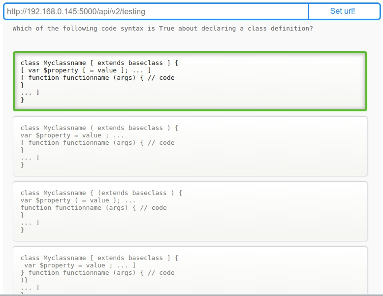
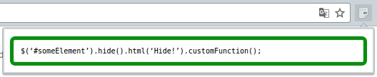
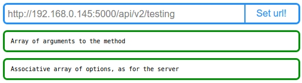
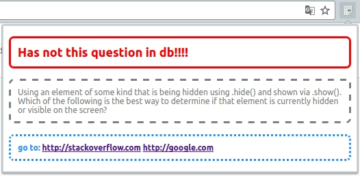
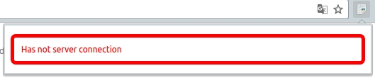
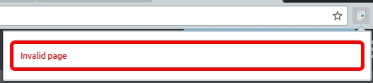

# toDoPizdato
Face It chrome extention
###How to use extention? (else ask developer!)

- [x] chrome
- [x] settings
- [x] extentions
- [x] check developer mode
- [x] click on: "Download unpakege extention"
- [x] set pas to folder "toDoPizdato"

##Responses
Response "old" with image

Response new one (or more) answer

Response info "Has not answer"

Error "Has not server connection"

Error "Invalid page"

