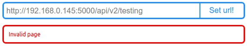

# Chrome extention API
Face It chrome extention work with API server
###How to use extention? (else ask developer!)

- [x] chrome
- [x] settings
- [x] extentions
- [x] check developer mode
- [x] click on: "Download unpakege extention"
- [x] set pas to folder "toDoPizdato"

###Settings

##Responses from server
The first type of response with image

The second type of response 'one or more anwser's cases'

Response data in case of absence of a question

The error 'The connection with server is absent'

The error 'The page is invalid'

